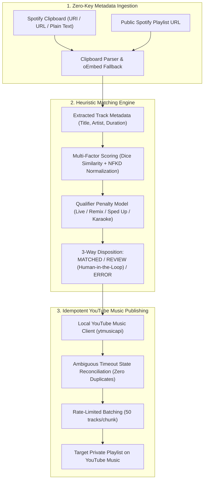

# PlaylistBridge

> Local-first, privacy-focused Spotify to YouTube Music playlist migration desktop app with resilient write reconciliation and fuzzy matching.

[]()
[]()
[]()
[]()

English documentation | Guida in italiano: [docs/GUIDA_WINDOWS.md](docs/GUIDA_WINDOWS.md)

---

## Overview

Migrating music playlists between streaming platforms is often frustrating. Commercial cloud-based migration services (such as Soundiiz or TuneMyMusic) present significant drawbacks:
- **Invasive Account Permissions:** They require full cloud OAuth permissions to your personal Google and Spotify accounts on third-party remote servers.
- **Artificial Paywalls:** They restrict free transfers to 100 tracks, demanding recurring subscriptions for full libraries.
- **Privacy Exposure:** They log and profile your listening history and personal data.

**PlaylistBridge** eliminates the middleman. It is a lightweight, zero-cloud desktop utility that runs 100% on your machine. It imports Spotify playlists without requiring developer API keys, runs an intelligent heuristic matching engine, and creates private playlists on YouTube Music with atomic crash recovery and zero duplicate tracks.

> [!NOTE]
> **No Audio Downloading:** PlaylistBridge operates exclusively on **textual metadata** (song title, artist, duration, video IDs). It does not perform stream ripping, download audio files, or bypass DRM.

---

## Architecture



---

## Core Engineering Highlights

### 1. Network Idempotency & Ambiguous Timeout Reconciliation
When adding tracks to remote playlists, an HTTP network timeout does not necessarily indicate a failure—it often means the server committed the write but the response was dropped. Naive retries result in duplicate tracks.  
PlaylistBridge queries the remote playlist state (`get_playlist`) before retrying: if the chunk is already present, it reconciles the session without duplication; if external modifications occurred, it safely aborts.

### 2. Multi-Factor Fuzzy Matching with Human-in-the-Loop
Rather than simple string comparison, PlaylistBridge utilizes a weighted heuristic scoring engine:
- **Unicode NFKD Normalization:** Strips diacritics while preserving CJK characters and symbols.
- **Weighted Token Scoring:** 55% title similarity, 30% artist match, 15% duration alignment.
- **Asymmetric Version Penalty:** Heavily penalizes mismatched version labels (`Live`, `Acoustic`, `Remix`, `Instrumental`, `Sped Up`, `Karaoke`).
- **3-Way Disposition:** Tracks are categorized into `MATCHED`, `REVIEW` (flagged for manual confirmation in the GUI), or `ERROR`, avoiding false-positive overwrites.

### 3. Zero-Cloud Data Sovereignty & OS-Level Security
- **Windows DPAPI Encryption:** Local session cookies and authentication headers are encrypted at rest using native Windows Data Protection API (`CryptProtectData` via `ctypes`).
- **Log Credential Redaction:** Sensitive headers (e.g., `cookie`, `authorization`) are automatically masked from exception messages and UI dialogs.
- **Spreadsheet Formula Injection Prevention:** CSV export sanitizes fields starting with `=, +, -, @` to prevent remote formula execution when opening migration reports in Microsoft Excel.

### 4. Frictionless Ingestion (Zero Developer Keys)
Users are not required to register for a Spotify Developer account to generate Client IDs and Secrets. PlaylistBridge parses desktop clipboard data directly (`Ctrl+A` $\rightarrow$ `Ctrl+C` in the Spotify desktop client) and transparently resolves missing track details via public oEmbed endpoints.

---

## Download for Windows Users

To use the standalone application on Windows (no Python installation required):

1. Download the latest release: **[PlaylistBridge-windows-x64.zip](https://github.com/gabrizanni/playlistbridge/releases/latest)**.
2. Extract the ZIP archive into a folder.
3. Run `PlaylistBridge.exe`.
4. Follow the step-by-step Italian guide in [docs/GUIDA_WINDOWS.md](docs/GUIDA_WINDOWS.md).

---

## Developer Quickstart

PlaylistBridge is written in Python 3.12+ and runs natively on Windows, macOS, and Linux:

```sh
# 1. Clone repository
git clone https://github.com/gabrizanni/playlistbridge.git
cd playlistbridge

# 2. Create virtual environment and install dependencies
python3 -m venv .venv
source .venv/bin/activate    # On Windows: .\.venv\Scripts\Activate.ps1
pip install -r requirements-dev.txt

# 3. Run unit test suite (39 tests in <0.05s)
pytest

# 4. Run linting checks
ruff check .

# 5. Launch desktop application
python -m playlistbridge.app
```

---

## Building from Source (Windows)

To produce the standalone distribution folder and ZIP package on Windows:

```powershell
powershell -ExecutionPolicy Bypass -File .\scripts\build_windows.ps1
```

The compiled output will be generated at `dist\PlaylistBridge-windows-x64.zip`.

---

## Legal & Fair Use Disclaimer

- **Independent Project:** PlaylistBridge is an independent open-source project and is **not affiliated with, endorsed by, or sponsored by** Spotify AB, Google LLC, or YouTube.
- **Trademark Notice:** "Spotify", "YouTube", and "YouTube Music" are registered trademarks of their respective owners. They are used here strictly for descriptive and nominative fair use purposes.
- **Personal Use:** This utility is intended solely for personal metadata migration between services where the user holds legitimate accounts.
- **Third-Party Licenses:** For details on open-source dependencies, see [THIRD_PARTY_LICENSES.md](THIRD_PARTY_LICENSES.md).

---

## License & Author

- **License:** [MIT License](LICENSE)
- **Author:** Developed by [Gabriele Zanni](https://github.com/gabrizanni).
